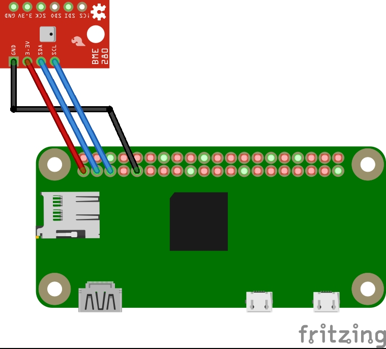

# RPI temperature watcher

## Introduction
Web server using a Raspberry Pi and BME280 sensor to graph the humidity and temperature over time. The data can be accessed over a web browser.

## Setup
```bash
sudo raspi-config
# enable I2S
```
Run full setup
```bash
./setup.sh
```

## Summary

The `temp_app.py` is the flask application that creates the webpages. This flask app will be loaded by the fastcgi plugin of lighttpd.

The database will be filled by a cronjob that triggers the python script `append_db.py` every x minutes (5min).

The webserver has 2 views, `temp.html` and `temp_db.html`, which I are the home page and the history page.

### Home page

In the current view, the current temperature and humidity taken from the sensor is displayed on the web page. This page updates every 10 seconds, and has a link to the historic view.

### History page

The history view has a couple features. The first is a to and from date input, which uses a date time picker plugin. Combined with a submit button, this allows you to view the temperature and humidity data within any date time range easily. The next feature are four radio buttons, to easily see the last 3, 6, 12, and 24 hours of data. There is also a link to go abck to the home page.

The main view are 2 tables combined with Google Charts graphs. The tables both scroll, and the charts display data across the time selected. The times are displayed in your own time zone, as it is determined from your browser.

## Usage
Manual test webserver
```bash
source venv/bin/activate
python3 temp_app.py
```

Manual messurement to db
```bash
./cron_trigger.sh
```

Take a peak at the db db
```bash
venv/bin/python get_data.py
```

## Info
* [GitHub - bme280-python](https://github.com/pimoroni/bme280-python)
* [GitHub - Pi-Temp](https://github.com/cwalk/Pi-Temp.git)
* [GitHub - RPI-Flask-SQLite](https://github.com/Mjrovai/RPI-Flask-SQLite)
* [GitHub gist - lighttpd flask](https://gist.github.com/brucebot/85b7022f32d640180c482123df0ce658)
* [gauge website](https://ukmesh.org/2020/01/26/raspberry-pi-dht22-temp-sensor-and-web-server)

## Circuit Diagram


